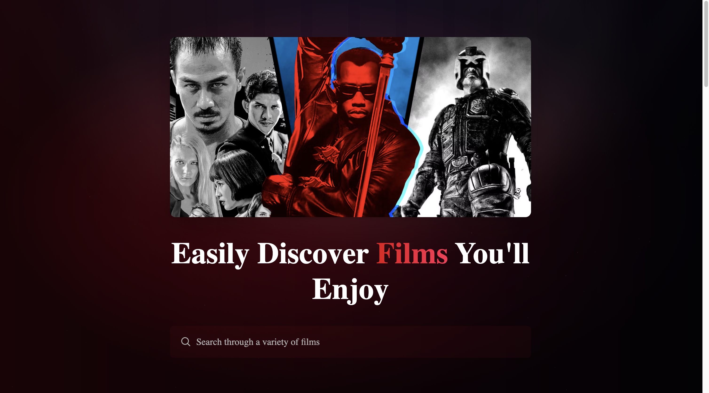
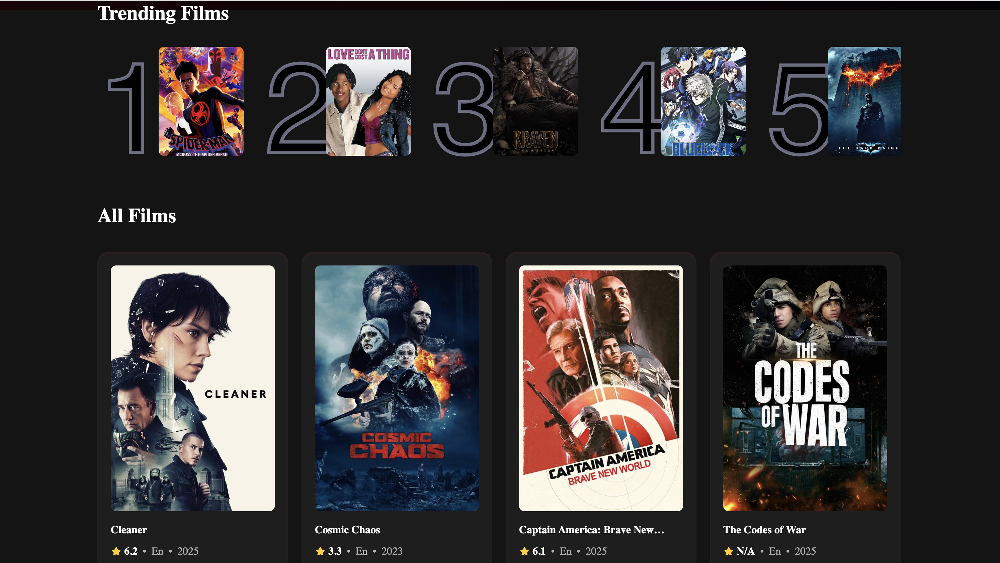

# 🎬 Movies Web Project

Discover, explore, and enjoy trending and underrated films with a sleek, cinematic UI.

🔗 Live App: [oha-movies-web-project.vercel.app](https://oha-movies-web-project.vercel.app)

---

## 📸 Screenshots




---

## 🎬 Demo Preview


---

## 🚀 Features

- 🔍 Search for films by title using The Movie Database API
- 📈 View trending movies with dynamic rankings
- 🎨 Netflix-style visual design with dark red & black gradient background
- ⚡ Fast UI built with Vite + React + Tailwind CSS
- 🧠 Intelligent search debouncing
- 🗃️ Modular and component-based architecture
- 📱 Responsive design across devices

---

## 🛠 Tech Stack

- **Frontend:** React + Vite + Tailwind CSS
- **APIs:** [TMDb API](https://developer.themoviedb.org/)
- **Hosting:** [Vercel](https://vercel.com)
- **Design:** Custom gradients, Figma background overlays

---

## ⚙️ Getting Started

Clone the repo and install dependencies:

```bash
git clone https://github.com/your-username/oha-movies-web-project.git
cd oha-movies-web-project
npm install
```

Create a `.env.local` file with your TMDb API keys e.g.:

```env
VITE_TMDB_API_KEY=your_tmdb_api_key_here
```

Start the dev server:

```bash
npm run dev
```

---

## 🗂 Project Structure

```
src/
├── components/       # Reusable UI components
├── App.jsx           # Main application layout
├── index.css         # Tailwind + global styles
├── main.jsx          # React entry point
```

---

## 🔮 Future Enhancements

- 🧑‍💻 User login and saved watchlists
- 📺 Film trailers and previews
- 🔎 Genre/category filters
- 🎭 Actor and director pages
- 📊 User ratings and reviews

---

## 🪪 License

This project is licensed under the MIT License — feel free to fork and build on top of it.
